# Deluxury


</br>

## 서비스 소개

👜 <em>명품 브랜드 의류, 가방, 신발 등을 판매하는 <strong>Deluxury</strong>입니다.</em>👜

-   **음악**을 들으며 다양한 명품 브랜드 제품을 구경하고, 구매할 수 있습니다.
-   메인 페이지의 **스크롤 기반 이미지 갤러리**를 통해, 사용자가 페이지를 스크롤할 때마다 명품 브랜드의 매력적인 이미지를 동적으로 체험할 수 있습니다.
-   구매자 계정뿐만 아니라, 판매자 계정으로도 가입이 가능하며 상품을 등록할 수 있습니다.
-   **Cloudinary**를 통해 상품 이미지를 쉽게 업로드하고 관리할 수 있습니다.
-   **다음 우편번호 API**를 사용하여 손쉽게 배송지를 입력할 수 있습니다.

</br>

## 배포 링크 및 테스트 계정

👉🏻 [Deluxury](https://deluxury.netlify.app/ "바로가기")

```구매자 계정
ID: user1@gmail.com
PW: 123
```

```판매자 계정
ID: admin1@gmail.com
PW: 123
```

</br>

## UI

#### - 주요 화면

<div align="center">
  <table>
    <tr>
      <td align="center"><b>메인페이지</b></td>
      <td align="center"><b>회원가입 약관</b></td>
    </tr>
    <tr>
      <td>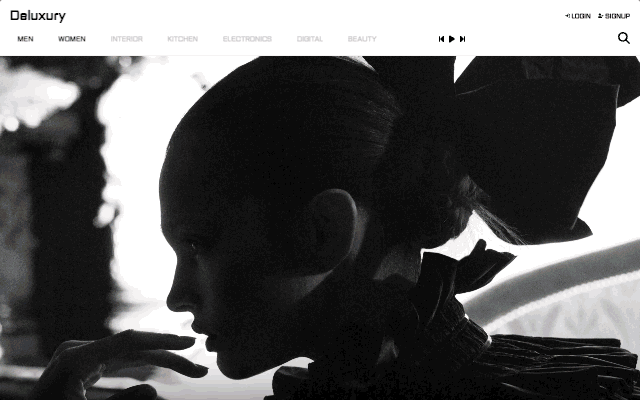</td>
      <td></td>
    </tr><tr>
      <td align="center"><b>상품 리스트</b></td>
      <td align="center"><b>상품 상세</b></td>
    </tr>
    <tr>
      <td>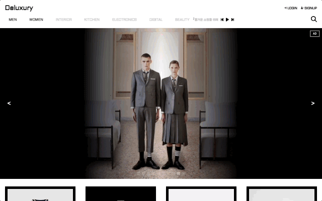</td>
      <td>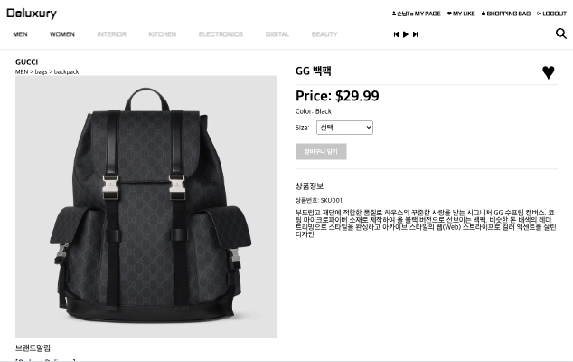</td>
    </tr>
    <tr>
      <td align="center"><b>구매자 로그인</b></td>
      <td align="center"><b>판매자 로그인</b></td>
    </tr>
    <tr>
      <td>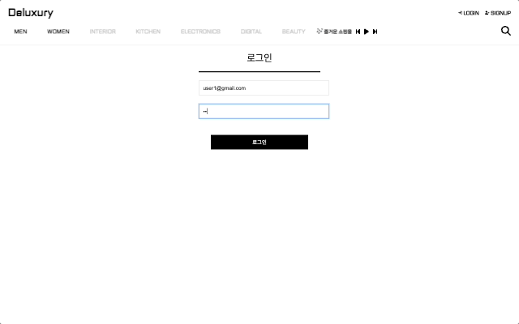</td>
      <td>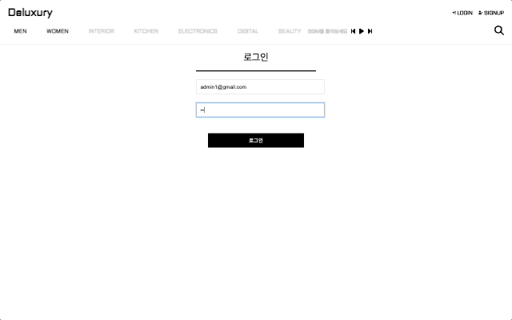</td>
    </tr>
    <tr>
      <td align="center"><b>검색</b></td>
    </tr>
    <tr>
      <td>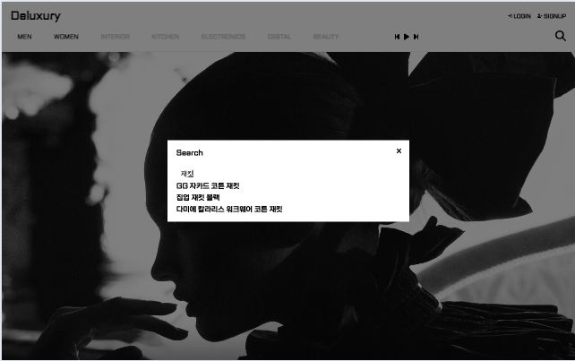</td>
    </tr>
    <tr>
      <td align="center"><b>찜목록</b></td>
      <td align="center"><b>장바구니</b></td>
    </tr>
    <tr>
      <td>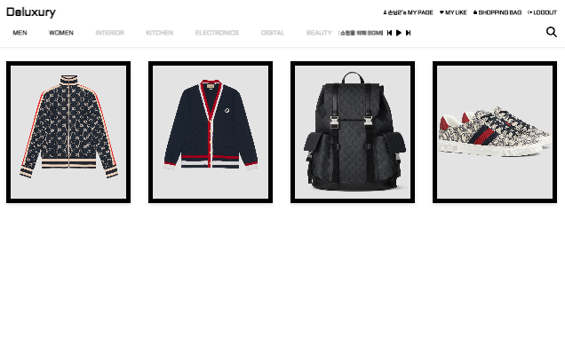</td>
      <td>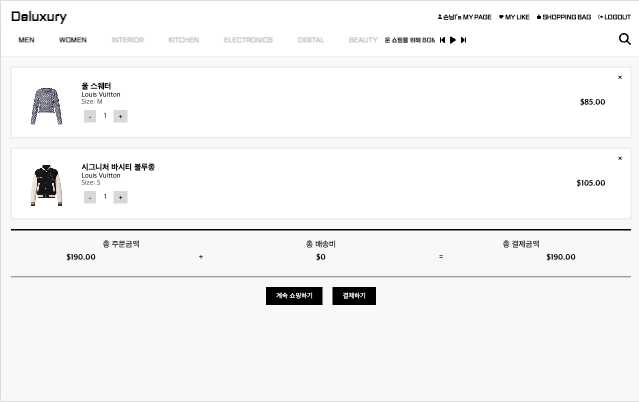</td>  
    </tr>
    <tr>
        <td align="center"><b>결제 카드 입력</b></td>
      <td align="center"><b>결제 주소 입력</b></td>
    </tr>
    <tr>
        <td>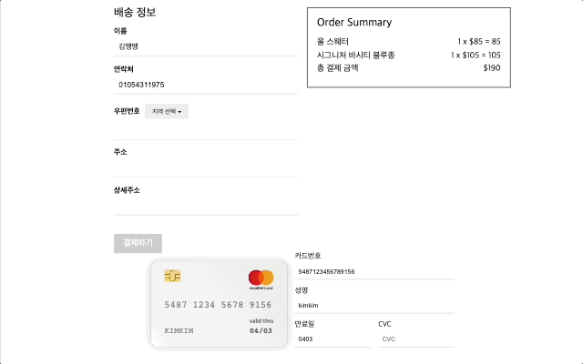</td>
      <td></td>
    </tr>
    <tr>
         <td align="center"><b>주문내역 확인</b></td>
      <td align="center"><b>상품 등록</b></td>
    </tr>
    <tr>
      <td>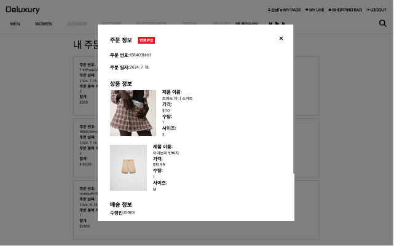</td>
      <td>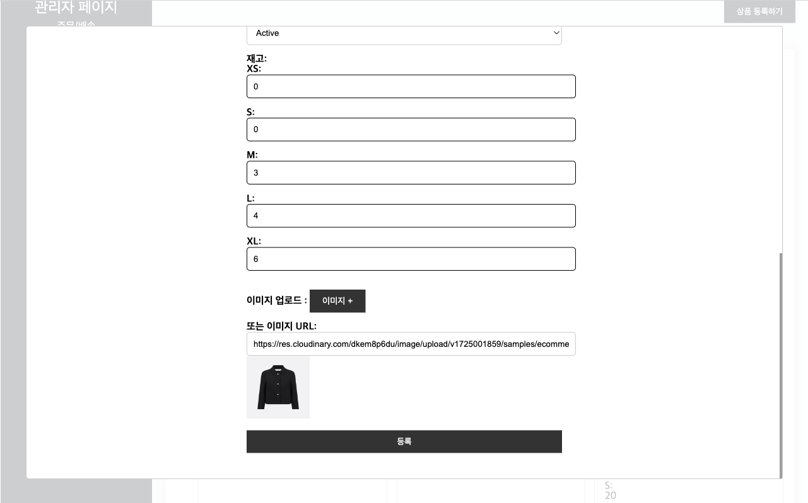</td>
    </tr>
  </table>
</div>

## 기술 스택 및 개발 환경

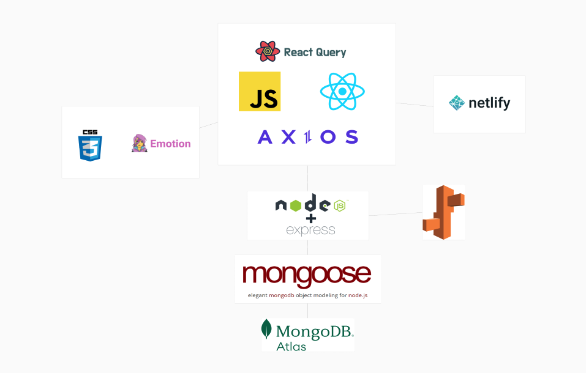

## 프로젝트 폴더 구조

### 프론트엔드

```
📁 highendshopping-fe
├──📁 src
│   ├──📁 action
│   ├──📁 asset
│   ├──📁 components
│   ├──📁 hooks
│   ├──📁 layout
│   └──📁 pages
│       ├──📁 Adminpage
│       ├──📁 Cartpage
│       ├──📁 Homepage
│       ├──📁 Loginpage
│       ├──📁 Mylikepage
│       ├──📁 Mypage
│       ├──📁 Orderpage
│       ├──📁 OrderSuccesspage
│       ├──📁 Paymentpage
│       ├──📁 ProductDetailpage
│       ├──📁 Productpage
│       ├──📁 RegistProductpage
│       └──📁 SignUppage
│   ├──📁 reducer
│   ├──📁 routes
│   ├──📁 store
│   └──📁 utils
│
├──📄 App.js
├──📄 index.css
├──📄 index.js
└──📄 .env
```

### 백엔드

```
📁 highendshopping-be
├──📁 controllers
│   ├──📄 auth.controller.js
│   ├──📄 cart.controller.js
│   ├──📄 like.controller.js
│   ├──📄 order.controller.js
│   ├──📄 product.controller.js
│   └──📄 user.controller.js
├──📁 models
│   ├──📄 Cart.js
│   ├──📄 Like.js
│   ├──📄 Order.js
│   ├──📄 Product.js
│   └──📄 User.js
├──📁 routes
│   ├──📄 auth.api.js
│   ├──📄 cart.api.js
│   ├──📄 indexRouter.js
│   ├──📄 like.api.js
│   ├──📄 order.api.js
│   ├──📄 product.api.js
│   └──📄 user.api.js
└──📁 utils
   └───📄 randomStringGenerator.js


```
